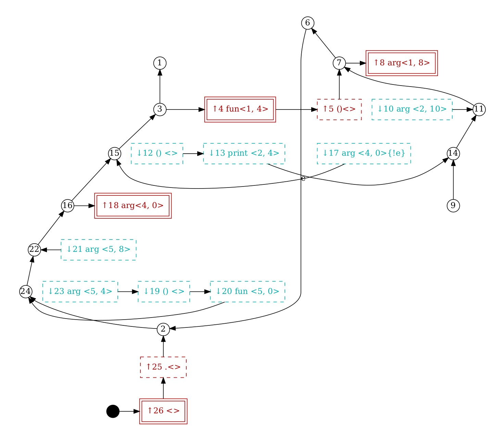
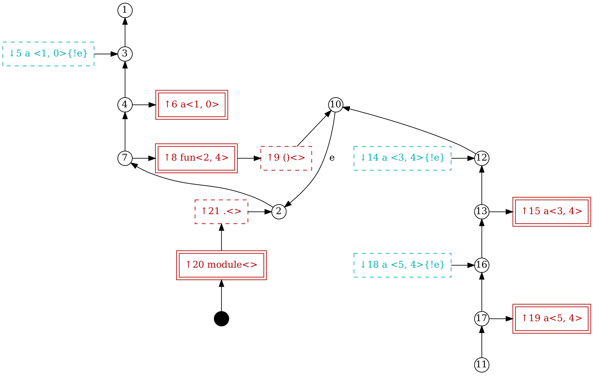

# breakfast

AST based refactoring tool for and written in Python. (Pretty early days,
somewhat usable.)

## Status

breakfast tries to refuse to guess in the face of ambiguity, so it
*should* leave code that it doesn't fully understand alone, but I would
definitely recommend using it only on code that is under version
control, and make sure to inspect the diffs it produces.

Currently *only* the rename (across multiple files) refactoring is
implemented, and does not even support all of Python yet. More may
follow.

I am using the plug-in myself, and fix bugs when I find them, and I am
getting some modest value out of it.

(Neo)Vim is the editor I'm stuck with, for better and for worse, so my
focus is to be able to use breakfast as a plugin there. Having said
that, there is almost no vim specific code in this repository, other
than what is needed to be able to install the project as a plugin from
Github. Everything is implemented as an LSP server, and thus should work
with other editors and IDEs that support that protocol.

I use Linux as my operating system of choice, and while I have tried
hard to not make too many assumptions about the OS, it's likely that
you'll encounter some issues if you try to use this project on Windows.
I'll happily accept bug reports and patches, and suggestions on how to
improve testing that will make stronger guarantees there.

## Installation

...

## Implementation

Based in part on the amazing work done on Scope Graphs/Stack Graphs by
Eelco Visser, Hendrik van Antwerpen, Douglas Creager, and others.
(Though none of these people are responsible for/involved in this
project or even aware it exists.)

It's likely that my implementation is naive or incorrect, and I've added
hacks to deal with things I couldn't figure out from the papers and
presentations I found online. [1](#1)

Douglas Creager's excellent Strangeloop talk in particular, is what
inspired me to switch to using Stack Graphs in this project. Even if you
have no interest in using breakfast, I highly recommend his
presentation:

Links:

* <https://www.youtube.com/watch?v=l2R1PTGcwrE>
* <https://pl.ewi.tudelft.nl/research/projects/scope-graphs/>

I've included some graphviz code to assist in debugging which renders
scope graphs in a similar  way to the one used in the presentation.The
result is much uglier, but worked for its intended purpose.

For example, this code:

```python
def fun(arg=1):
    print(arg)

arg = 8
fun(arg=arg)
```

Results in this image:




## Why 'breakfast'?


1. I don't know if it's the most important, but it's a good meal. Also
   it has AST in it.
2. breakfast and move things > move fast and break things

## Testing

To run tests:

```
make test
```

## History

In an act of unbelievable hubris, I started this project in 2015 out of
frustration with existing Python refactoring tools, and in particular the
venerable Rope, which is generally pretty good, and is still miles
ahead of this project in almost every way. In particular I tried to
rename a variable in some code I was working on, and rope also changed
an occurrence of the same sequence of characters inside a string literal
somewhere. This may have been a superficial bug, but it made me trust
the tool less, making me less eager to use it. The one guarantee I'm
striving for with this library is that renaming will respect Python's
scoping rules, and not touch any other strings in the code that happen
to be identical.


## Footnotes

### 1
For instance, how to handle redefinition of variables in Python,
in in code like:

```python
a = 0
def fun():
    a = 1
    ...
    a = 2
```


One choice would be to view these as separate definitions, which would
require separate rename refactorings. (And rewriting of statements like
`a += n`.) My solution is to add occurrence (push) nodes for definitions
that will look back for earlier definitions (only) in the same scope,
but don't require any to be found.
